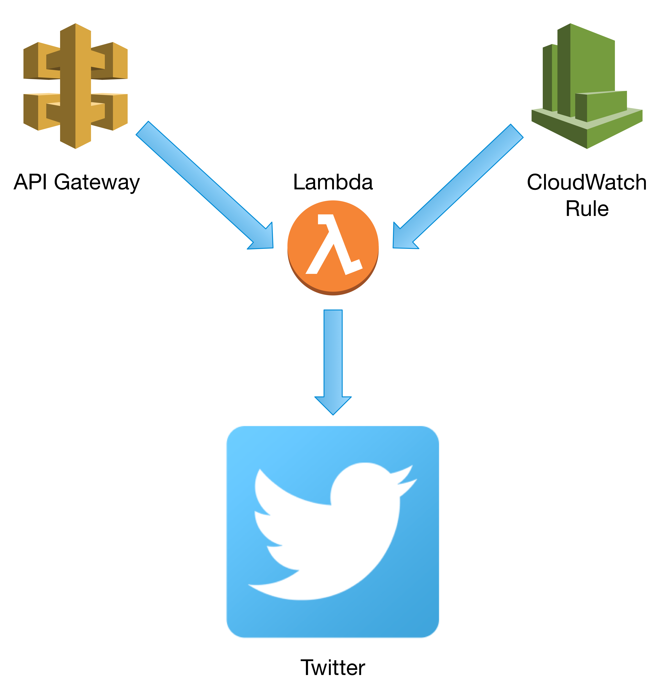
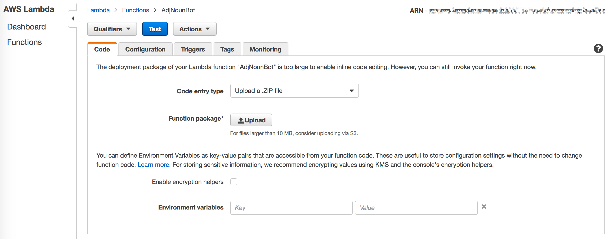
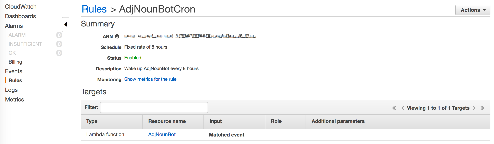
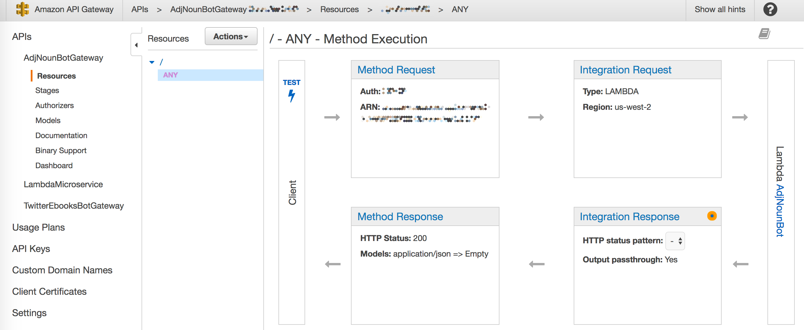

# Adjective Noun Bot

## Overview

[@AdjNounBot](https://twitter.com/adjnounbot) is a Twitter bot that runs on AWS Lambda. Three times a day, it posts a word pair (one adjective and one noun) and the top result of an image search for those words.

Long ago, during the wild times of the 2004 internet, I ran a site of web experiments called Adjective Noun. More on that in a blog post (TODO: write and link). The site's header had random (but curated) pairings adjectives with nouns, coupled with a clever stock photo. The site has faded into obscurity, but the concept has never disappeared from my mind.

This bot is a reconceptualization of that technique — perhaps a little more automated, a little less curated — for the modern Twitter world.

The AdjNounBot code is copyright 2017 by [Brian Enigma](https://netninja.com/about/) and released under a [Creative Commons Attribution-NonCommercial-ShareAlike 4.0 International License](http://creativecommons.org/licenses/by-nc-sa/4.0/).


## The Code

The code is a fairly short and simple Python script, plus a pair of word lists. The words were extracted from [Princeton's WordNet](https://wordnet.princeton.edu/) lists, trimmed down to popular words by matching against the [Nutrimatic](https://github.com/egnor/nutrimatic) word lists, and hand-edited to remove profanity.

The heavy-lifting of posting to Twitter is taken care of by the [python-twitter](https://github.com/bear/python-twitter) library.

Image search is via the [Microsoft Cognitive Services](https://www.microsoft.com/cognitive-services/en-us/bing-web-search-api) Bing API. 

Note that both the Twitter and Bing APIs require API keys. Twitter is free. Bing is free for 90 days. Beyond that, [there is a cost involved](https://azure.microsoft.com/en-us/pricing/details/cognitive-services/search-api/). Your API keys go into local_settings.py, as per the instructions below.


## The Environment

The code runs on Lambda, but that by itself isn't enough to post to Twitter. There are two possible options for that. You can post on a timer (similar to a Unix cron job) and/or you can post in response to hitting a web endpoint.



In my case, I have a CloudWatch rule that triggers every 8 hours, plus a small HTML dashboard app that lets me monitor recent tweets and trigger it manually.


## Setup

First, you will need some API keys. Make a copy of `local_settings_example.py` name `local_settings.py`. This will hold configuration specific to you and your accounts.

[Follow the python-twitter documentation](https://python-twitter.readthedocs.io/en/latest/getting_started.html) to get a Consumer Key, Consumer Secret, Access Token, and Access Token Secret for your Twitter account. You'll enter all of those into your `local_settings.py` file.

Next, sign up for the [Bing Web Search API](https://www.microsoft.com/cognitive-services/en-us/bing-web-search-api), if you haven't already. Copy one of your API keys and paste it into the appropriate place in `local_settings.py`.

While you're editing that file, set the `ODDS` to `1` (meaning it will always run) and leave `DEBUG` as `True`.

At this point you should be able to run the following commands:

```shell
make package
cp fake_lambda.py ./package/
cd package
./fake_lambda.py
```

This will kick off the bot in an artificial Lambda environment. It will execute, generating a tweet and image, but not actually post to Twitter (because `DEBUG` is true). You should get a little JSON blob with `message` and `url`.

If this looks good, set `DEBUG` to `False`. This makes the Twitter posting _live_. Program runs _will_ post to Twitter. Try running again, and verify that it posted correctly.

At this point, you can run the `make deploy` build target. This will package up the code and dependencies into a nice zip file that you can upload into your Lambda console. 





The big blue “Test” button should do the same thing: post to Twitter and return a little JSON blob with `message` and `url`. 

Once this is working, you can set up a CloudWatch rule that fires off the Lambda function every so often.





You can always manually trigger the bot using the “Test” button in the Lambda console, but if you'd like to trigger it remotely, you can set up an API Gateway that also hits the bot's Lambda function.





And that should be all. Thanks for playing, and if you happen to build your own bots using anything here, please ping me and share your cool project!

